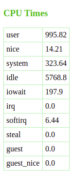

# CPU Times Doc

This repo has been made available under [MIT license](https://github.com/nick3499/psutil_cpu_times/blob/master/LICENSE).



- **user** : user mode time elapsed during normal process execution
- **system** : kernel mode time elapsed during process execution
- **idle** : elapsed idle time

### Platform-specific fields:

- **nice** (UNIX) : user mode time elapsed during niced (prioritized) process execution; on Linux: includes guest_nice time
- **iowait** (Linux) : time elapsed during waiting for I/O completion, but not accounted in idle time counter.
- **irq** (Linux, BSD) : time elapsed during hardware interrupt servicing
- **softirq** (Linux) : time elapsed during software interrupt servicing
- **steal** (Linux 2.6.11+) : time elapsed by other OSs running in a virtual environment
- **guest** (Linux 2.6.24+) : time elapsed running a virtual CPU for guest OSs under Linux kernel control
- **guest_nice** (Linux 3.2.0+) : time elapsed running a niced (prioritized) guest (guest OS virtual CPU under Linux kernel control)
- **interrupt** (Windows) : time elapsed servicing hardware interrupts (similar to _irq_ on UNIX)
- **dpc** (Windows) : time elapsed servicing DPCs (deferred procedure calls are interrupts of a lower priority than standard interrupts

## Virtual Environment

A Python virtual environment helps prevent changes to _system Python_ which would render an OS unstable. For example, if a Python module requires a previous version of a dependency, which _system Python_ also uses, and then changes such an existing dependency to another version, system instability can result. So, a Python virtual environment can help contain Python development within its own sandbox to help prevent it from knocking the swing set over or tilting the merry-go-round. For developers, virtual environments can become a system security measure of sorts.

Below, is an example of virtual environment creation:

```shell
user_foo@foo_host:~/Desktop$ python3 -m venv foo
user_foo@foo_host:~/Desktop$ cd foo
user_foo@foo_host:~/Desktop/foo$ ls -l
total 20
drwxrwxr-x 2 user_foo user_foo 4096 Jul  1 10:11 bin
drwxrwxr-x 2 user_foo user_foo 4096 Jul  1 09:30 include
drwxrwxr-x 3 user_foo user_foo 4096 Jul  1 09:30 lib
lrwxrwxrwx 1 user_foo user_foo    3 Jul  1 09:30 lib64 -> lib
-rw-rw-r-- 1 user_foo user_foo   69 Jul  1 10:10 pyvenv.cfg
drwxrwxr-x 3 user_foo user_foo 4096 Jul  1 10:10 share
$ source bin/activate
(foo) user_foo@foo_host:~/Desktop/foo$
```

## Start the App

In a Unix-like terminal emulator, enter the following:

`$ export FLASK_APP=cpu_times && FLASK_ENV=development; flask run`

- `FLASK_APP` environment variable specifies which app to load.
- `FLASK_ENV` environment variable specifies which environment the Flask app runs in. In this case, `development` indicates that the `flask run` command will enable _debug mode_, _interactive debugger_ and _reloader_.

Something close to the following will print to terminal:

```
 * Serving Flask app "cpu_times.py" (lazy loading)
 * Environment: development
 * Debug mode: on
 * Running on http://127.0.0.1:5000/ (Press CTRL+C to quit)
 * Restarting with inotify reloader
 * Debugger is active!
 * Debugger PIN: XXX-XXX-XXX
```

Open `http://127.0.0.1:5000/` in a browser. Since no port was specified, Flask defaults to port `5000`. If a different port number is required, the `FLASK_RUN_PORT` environment variable is available.

## cpu_times.py

```python
import psutil
from flask import Flask, render_template

app = Flask(__name__)

@app.route('/')
def index():
    ct = psutil.cpu_times()
    data = []
    for i in range(0, len(ct)):
        data.append([ct._fields[i], ct[i]])
    return render_template("cpu_times.html", data=data)

if __name__ == '__main__':
    app.run()
```

[psutil.cpu_times()](https://psutil.readthedocs.io/en/latest/#psutil.cpu_times) method returns system CPU times as a named tuple. For example:

```python
scputimes(user=1233.68, nice=14.35, system=424.85, idle=9685.94, iowait=219.69, irq=0.0, softirq=7.82, steal=0.0, guest=0.0, guest_nice=0.0)
```

Key/value pairs extracted from `scputimes` are appended to the `data` variable.

For example, the populated `data` list will look similar to:

```python
[['user', 15938.28], ['nice', 66.49], ['system', 4857.8], ['idle', 46858.49], ['iowait', 486.59], ['irq', 0.0], ['softirq', 88.71], ['steal', 0.0], ['guest', 0.0], ['guest_nice', 0.0]]
```

[render_template](https://flask.palletsprojects.com/en/1.1.x/api/#flask.render_template) method receives the template's filename, and the `data` variable which is passed to the template engine.

```python
if __name__ == '__main__':
    app.run()
```

The code block above indicates that the Python interpreter will execute `cpu_times.py` as the _main_ program file which may also be referred to as the _source file_. Notice also that `debug` value is set to `True` when the app runs.

## cpu_times.html

[cpu_times.html](https://jinja.palletsprojects.com/en/2.10.x/templates/) is a Jinja template _which contains variables and/or expressions, which get replaced with values when a template is rendered; and tags, which control the logic of the template._

```html
<!DOCTYPE html>
<html lang="en">
<head>
  <title>CPU Times [PSUtil]</title>
  <style>
    h3 { color: #4CBB17; }
    table { border-collapse: collapse; }
    td {
      border: 1px solid #B4EEB4;
      padding: 5px;
      text-align: left;
    }
  </style>
</head>
<body>
  <h3>CPU Times</h3>
  <table>
  
    <tr>
      <td>{{ j[0] }}</td>
      <td>{{ j[1] }}</td>
    <tr>
  
  </table>
</body>
</html>
```

`` indicates that the template will loop through the list of key/value pairs in `data`, known as a `for` loop.

## PSUtil Version

[psutil 5.6.3](https://pypi.org/project/psutil/) is recommended.

- **psutil 5.6.3**, from PyPI, was tested in Ubuntu with **Python 3.6.8** and Google Chrome browser
- **python-psutil 5.4.2-1**, from the Ubuntu repo, only ran with **Python 2.7**
- Flask 1.1.1 was also installed using pip3

[python-psutil 5.6.3-1](https://www.archlinux.org/packages/community/x86_64/python-psutil/) from the Arch Linux repo may also be sufficient for Arch users, but was not tested.

FYI: Python 2.7 support ends in 2020.

## Alternative Startup

A shell script is recommended over a `.flaskenv` file. When a `.flaskenv` file was tested, unexpected results were experienced. An example of a `cpu_times.sh` could look like the following:

```sh
export FLASK_APP=cpu_times
export FLASK_ENV=development
flask run
```

`$ bash cpu_times.sh`
